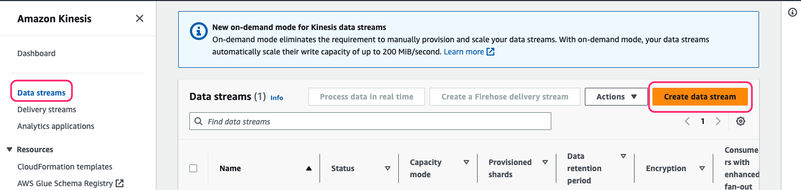
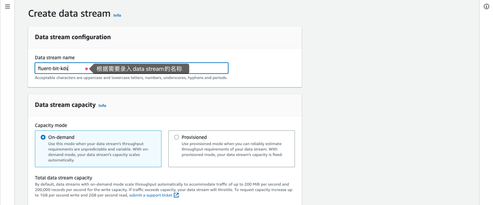

### 说明

本示例展示通过fluent-bit将日志信息传输至Amazon Kinesis Data streams, 然后使用Redshift的Stream ingestion实现实时入仓的功能，相关说明如下：

```
fluent-bit.conf: fluent-bit配置示例
stream_ingestion.sql: Redshift示例sql
```

### 配置说明

#### 权限配置

* fluent-bit AK、SK权限：`AmazonKinesisFullAccess`策略
* Redshift 集群角色：额外附加`AmazonKinesisFullAccess`策略

#### 配置步骤

1.创建Kinesis Data streams，根据需要录入stream名称（如fluent-bit-kds)其余保持默认，点击创建





2.修改fluent-bit配置文件，并重启fluent-bit
```shell
参考fluent-bit.conf配置文件
```


3.Redshift中创建物化视图接收数据
```shell
参考stream_ingestion.sql内容
```

#### Kafka INPUT  JSON数据处理

* 背景：Kafka INPUT 不能正确处理JSON格式数据，目前[PR](https://github.com/fluent/fluent-bit/pull/7492)暂未关闭

* 临时解决方式
    1. clone 上述 PR中的代码，并根据官方文档进行编译，编译成功后使用`build/bin/fluent-bit`文件替换`/opt/fluent-bit/bin/fluent-bit`
    2. 参考`fluent-bit-kafka.conf`更新配置文件，主要改动为添加如下配置项`data_format json`(指定消息格式为json)、`rdkafka.auto.offset.reset earliest`(读取所有消息)

### 参考资料
* Redshift stream ingestion https://aws.amazon.com/cn/redshift/redshift-streaming-ingestion/
* Kinesis data streams https://aws.amazon.com/cn/kinesis/data-streams/?nc1=h_ls