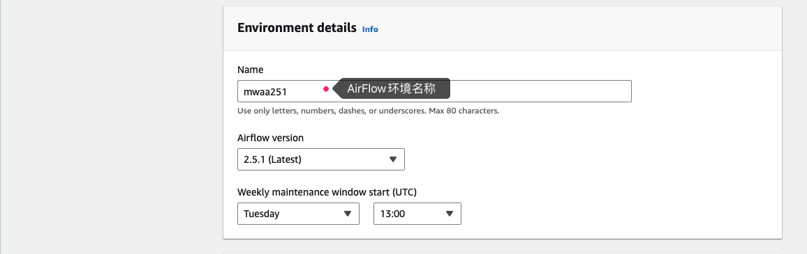
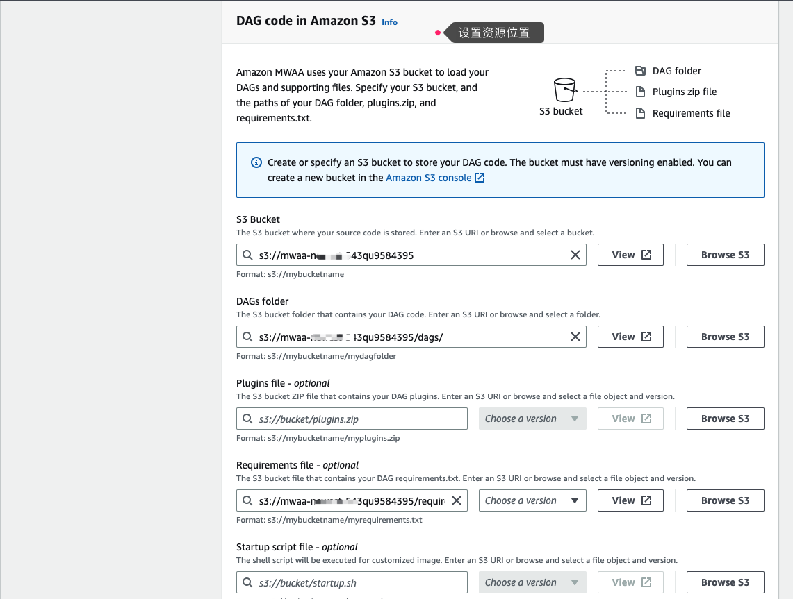
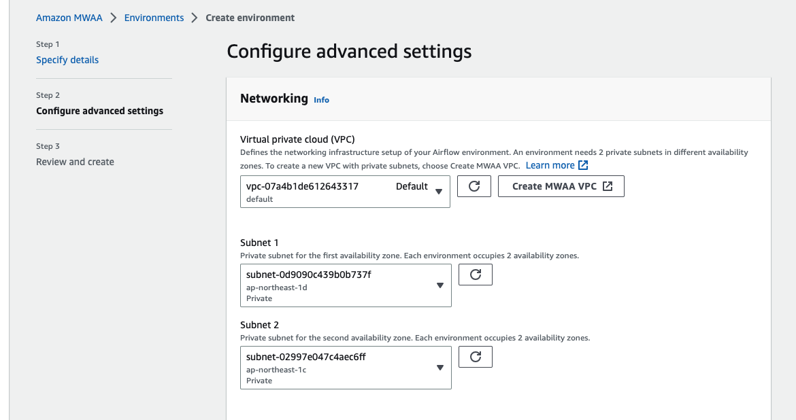
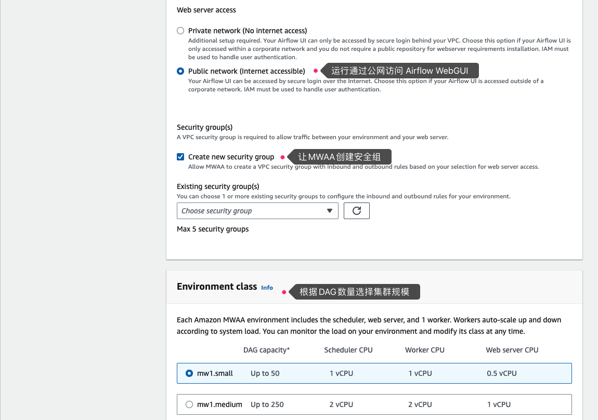
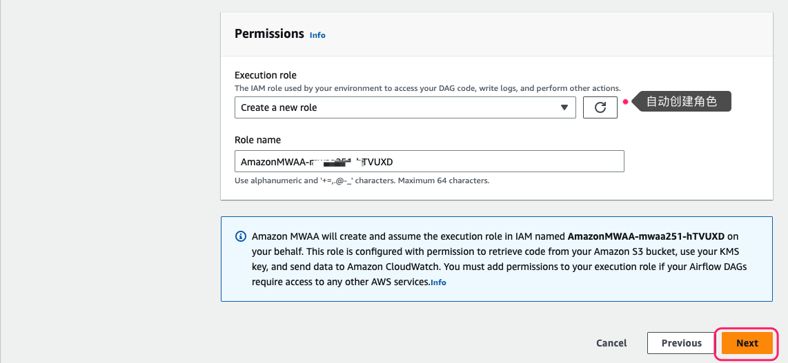
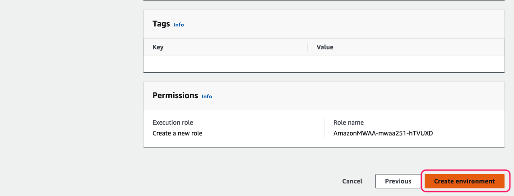

### MWAA配置文件说明

MWAA配置文件存放在S3存储桶，典型目录结构如下：

```
dags                                # 存放dag python文件
dags/sql/                           # 存放dag 引用的sql
requirements/requirements.txt       # AirFlow依赖文件
plugins/                            # 插件
scripts/                            # 启动脚本
```


### MWAA集群创建

1. 设置集群名称、版本


1. 设置资源位置


1. 选定私有子网（能够通过NAT访问互联网）


1. 设置公网访问、集群规模


1. 允许集群自动创建角色


1. 点击创建集群（若提示权限不足可等待30秒再试）
