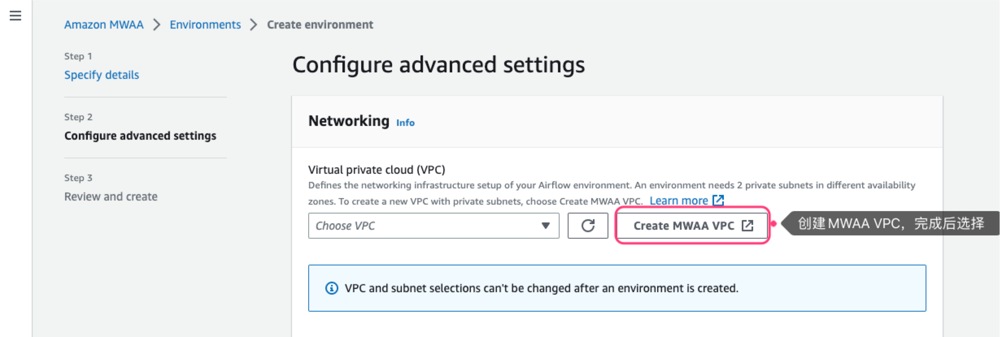
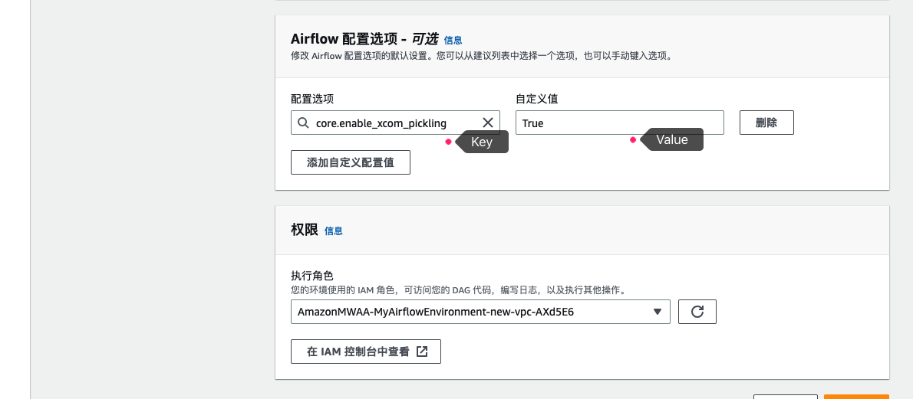
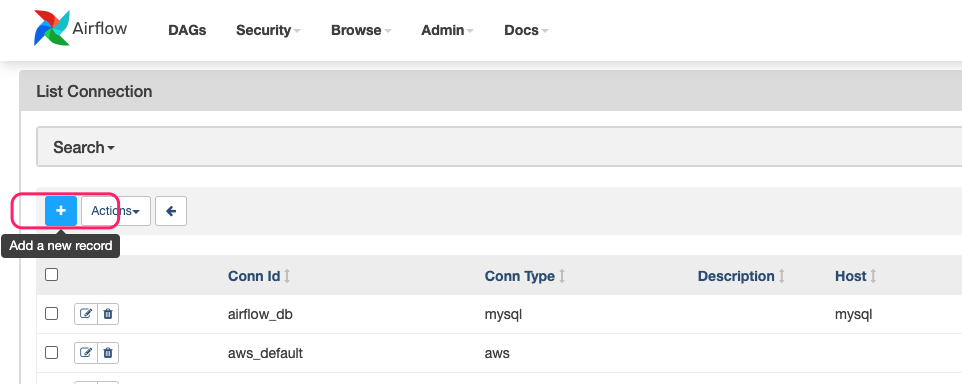

### MWAA配置文件说明

MWAA配置文件存放在S3存储桶，典型目录结构如下：

```
dags                                # 存放dag python文件
dags/sql/                           # 存放dag 引用的sql
requirements/requirements.txt       # AirFlow依赖文件
plugins/                            # 插件
scripts/                            # 启动脚本
```


### MWAA集群创建

1. 设置集群名称、版本(本示例使用2.5.1版本)


1. 设置资源位置


1. 创建MWAA VPC（耗时3-4分钟左右），完成后选择私有子网



1. 设置公网访问、集群规模


1. 允许集群自动创建角色


1. 点击创建集群（若提示权限不足可等待30秒再试），创建过程耗时大约20-30分钟


### 更新 MWAA 环境

* 更新依赖
更新requirements.txt文件，上传至S3桶，然后更新MWAA环境


* 更新AirFlow配置项，填入Key及Value

完整配置项查看[这里](https://airflow.apache.org/docs/apache-airflow/2.5.2/configurations-ref.html#)


### Redshift连接配置

1. 在AirFlow控制台点击`Open Airflow UI`等待登录

2. 进入连接配置界面


3. 如图所示配置Redshift连接（确保MWAA能够访问Redshift，为简便展示本示例通过互联网访问Redshift，即Redshift开启公网访问）



### 示例任务

```
s3_src/dags/redshift_dag_demo.py        # airflow 任务定义
s3_src/dags/sql/common.py               # airflow 任务中使用的sql
s3_src/requirements/requirements.txt    # 依赖文件
```

### Airflow 文件 CI/CD配置示例

参考[这里](./mwaa-cd.md)