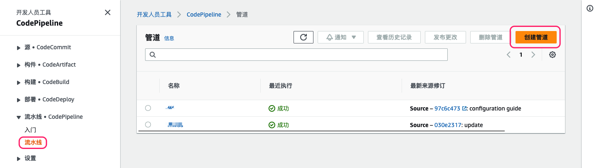
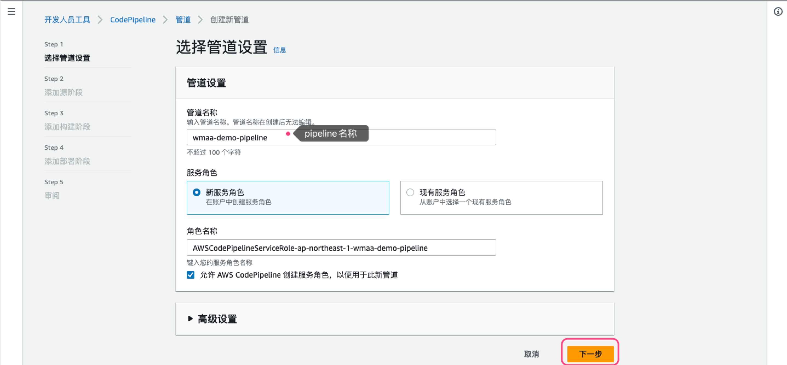
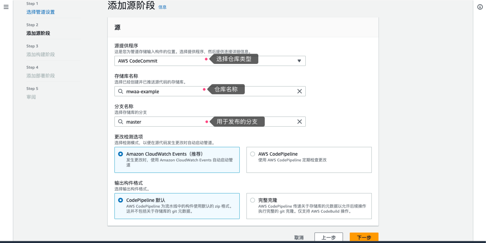
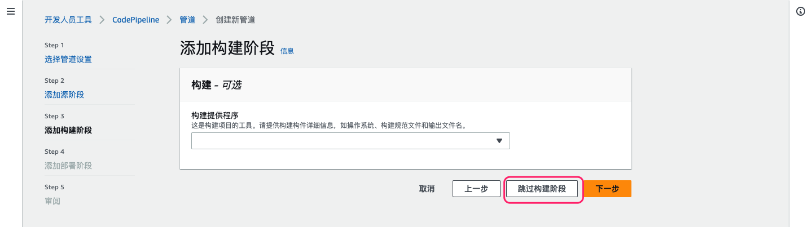
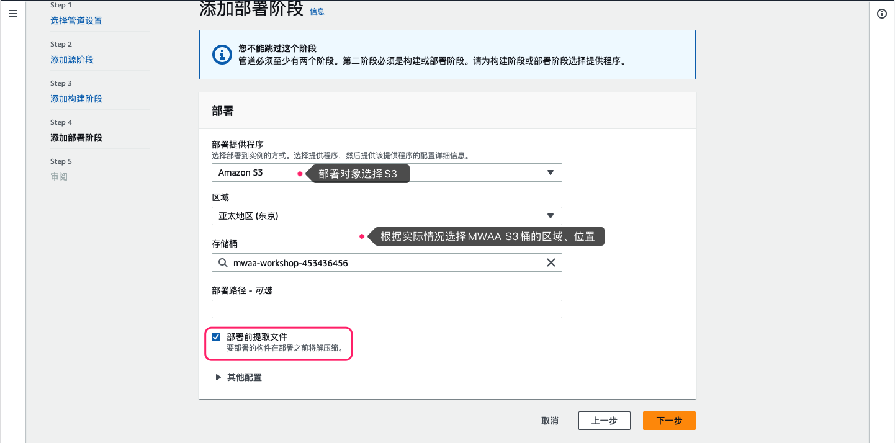
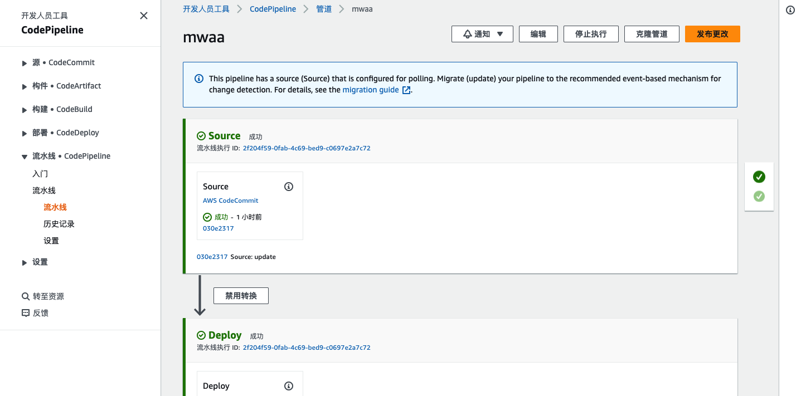

### MWAA 配置文件持续部署配置

MWAA配置文件存放在S3桶，为了方便协作开发及管理，推荐使用代码仓库管理代码及配置文件，再通过指定分支（如main）发布到S3桶。

本配置示例实现如下功能：
* 使用代码仓库存储源码（以Github为例，也可使用CodeCommit、Bitbucket）
* 使用AWS Code Pipeline检测代码改动，实现自动更新代码到S3桶

详细配置过程如下：

1. 创建代码仓库，并推送代码至仓库
1. 进入AWS Code系列控制台，左侧导航栏选择“流水线（Pipeline）”菜单，在右侧点击“创建”

1. 根据需要配置流水线名称，点击下一步

1. 配置代码仓库、分支

1. 只需要将代码复制到S3，因此跳过构建阶段

1. 配置部署位置

1. 推送代码到仓库的步骤4中指定的分支，即可看到pipeline成功运行，S3中的文件也被更新
