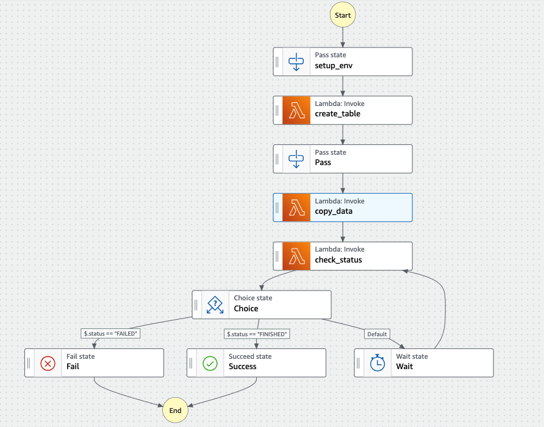
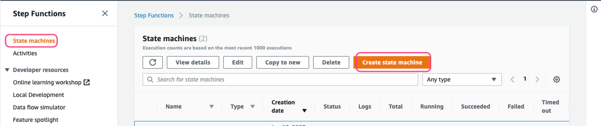
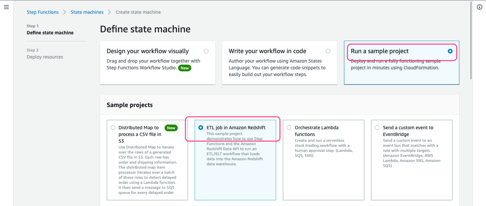
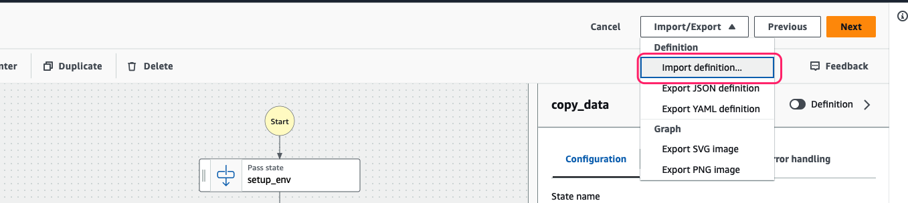

### 说明

本示例展示通过StepFunction、Redshift Data API、Lambda完成Redshift数据ETL示例。主要工作为：1.创建表；2.导入数据（等待数据导入完成）。流程图示意如下：

### 配置说明

1. 创建示例StepFunction应用（该应用会创建两个Lambda函数及一个Redshift cluster，后续可考虑删除）

注意：
* 需要调整Lambda对应的角色，添加`RedshiftFullAccess`权限

2. 创建StateMachine，在编辑器界面选择导入本示例的StateMachine定义文件`MyStateMachine.asl.json`

3. 调整Lambda中对应的Lambda ARN为步骤1中创建的ARN（xxxDataAPIxxx)

### 注意事项

* Lambda权限问题：确保Lambda函数对应的角色有权限获取Redshift集群的临时凭证（简单方式可给该角色添加RedshiftFullAccess策略）
* StateMachine权限：确保StateMachine角色可以调用Lambda函数（简单方式可给该角色添加AWSLambda_FullAccess策略）
### 参考资料
1. https://docs.aws.amazon.com/step-functions/latest/dg/sample-etl-orchestration.html
2. Redshift data api, [execute_statement](https://boto3.amazonaws.com/v1/documentation/api/latest/reference/services/redshift-data/client/execute_statement.html) 
3. Redshift data api, [describe_statement](https://boto3.amazonaws.com/v1/documentation/api/latest/reference/services/redshift-data/client/describe_statement.html)
4. Redshift data api, [get_statement_result](https://boto3.amazonaws.com/v1/documentation/api/latest/reference/services/redshift-data/client/get_statement_result.html)